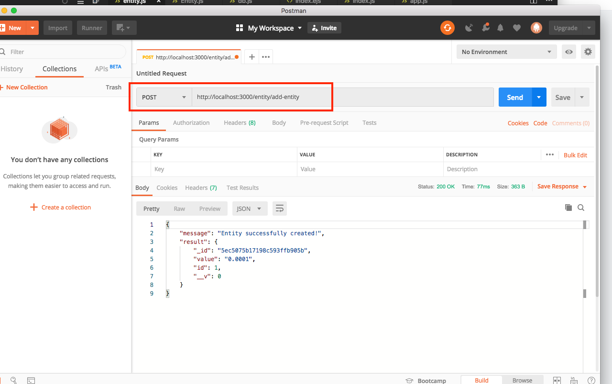
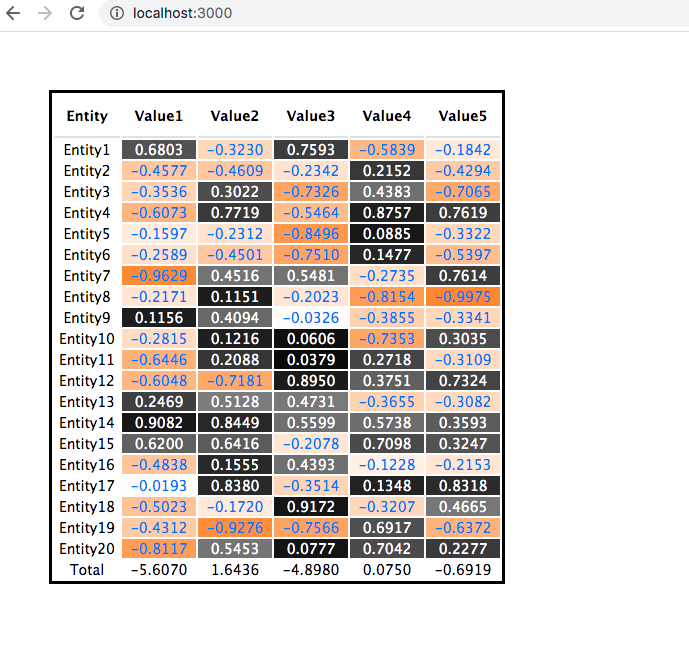

# Entity Client Application (Node.js+MongoDB)

# How to run app

- run the mongodb server

    brew install mongodb-community@4.2

    brew services start mongodb-community@4.2

    mongo

- install npm packages

    npm install

- add some seed datas

To add them, you need to use postman

- run the app

    node app.js

Finally, it looks like that

